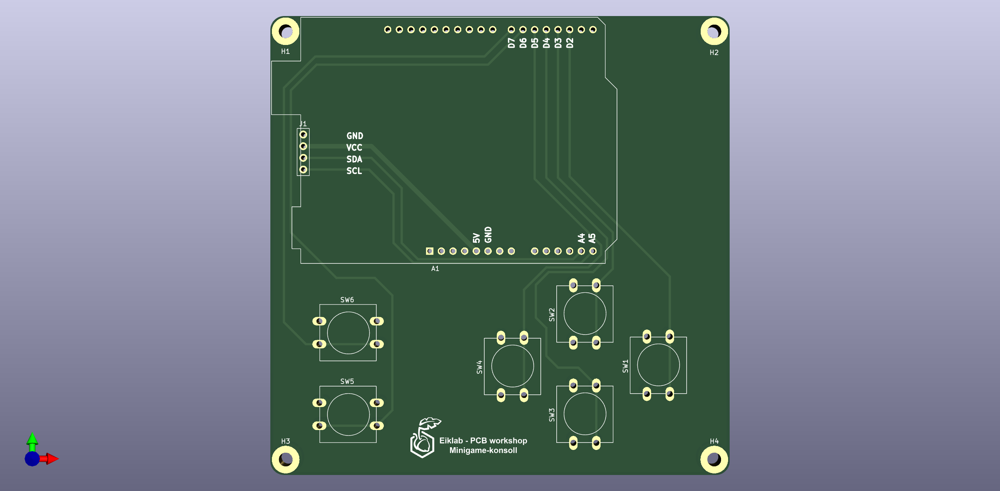

# PCB workshop

Workshopen handler om det grunnleggende innen kretsdesign og hvordan man designer en krets i KiCad. Som en del av minigame-konsoll prosjektet er PCB designet det første steget man tar for å lage produktet! 

Tips før du starter:
* Se gjennom "workshop_material/kræsjkurs_elektronikk.pdf" (Anbefalt hvis du ikke er helt sikker på elektronikk!)
* Se gjennom "workshop_material/PCB_workshop.pdf"
* Last ned KiCad 7.0

Fremgangsmetode for designprosessen i KiCad finner du i "PCB_tutorial.pdf".

  

