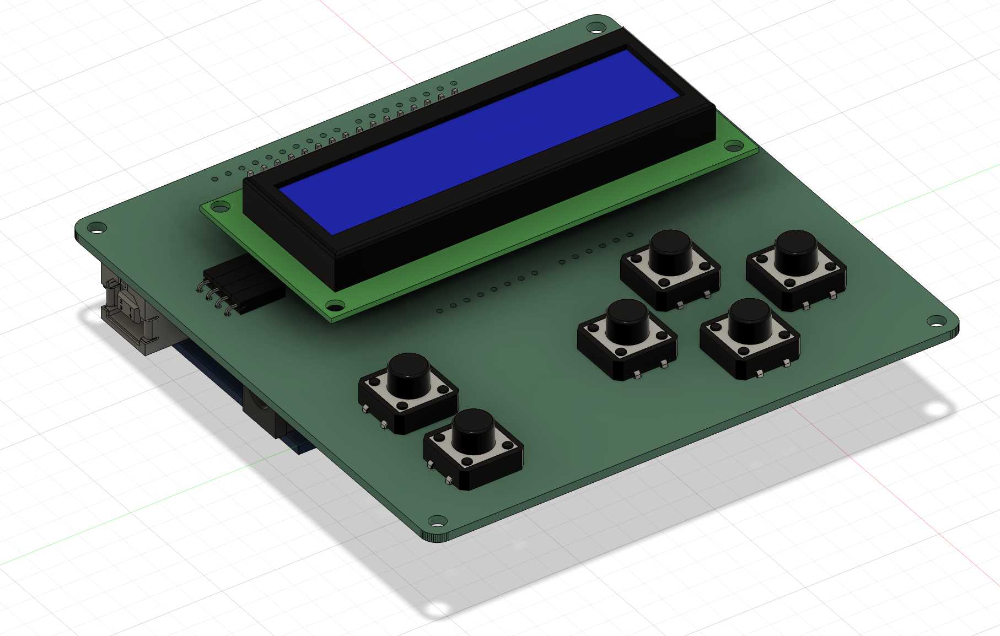

# Minigame-konsoll
Dette repoet inneholder alt du trenger for å lage en minigame-konsoll. Prosjektet er en del av tre workshoper: 

* PCB  
* 3D-modellering og 3D-printing 
* Mikrokontrollere og sensorikk 

Innhold blir lagt ut forløpende!

  

